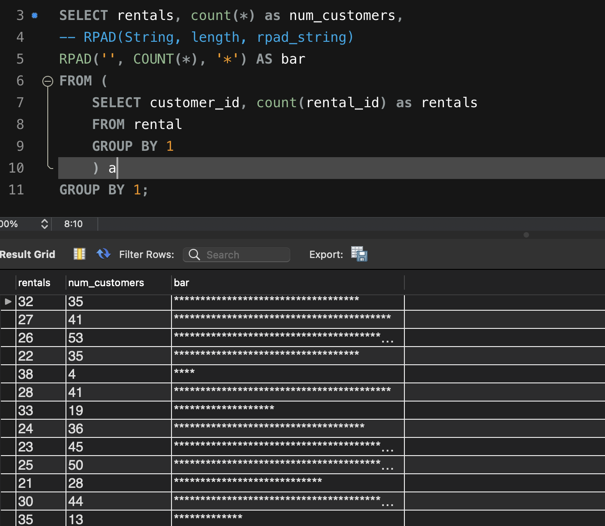

# Exploratory Data Analysis

## Background
This respository will highlight tools for conducting Exploratory Data Analysis (EDA). This instruction will also include establishing a database and populating data to begin conducting EDA. 

## Initialize Database

In this exercise, we will use a modified version of the [Sample Sakila Database](https://dev.mysql.com/doc/sakila/en/). The modified version will be referred to as the Bad Sakila Database. The modified database has been extended and had restraints removed to allow the addition of bad data. The goal of this exercise is to investigate the data and identify problematic data. 

For context, the Sakila database captures data related to movie rentals. The relational database schema is noted as follows:


Within the local instance of MySQL create the following schemas: 
- [Bad Sakila](bad-sakila-schema)
- [Sakila](sakila-schema.sql)

With the schema's defined, load the data: 
- [Bad Sakila Data](bad-sakila-data.sql)
- [Sakila Data](sakila-data.sql)

## Investigate Database
Initially, will need to get a feel for the database. A good command to start with would be:

``` sql
SHOW TABLE STATUS 
```


This highlights how many tables, along with a few descriptors, including how many rows per table, format, row length, etc. 

Next, investigate content of tables. In this case, let’s look at how many films are in this database? By using this query: 
``` sql
SELECT count(*) from film;
```
It is clear that there are 1000 films. 
For a more complete picture, let’s investigate how many films are available in each category. This will require data from multiple tables (film_category, film, and category) and, as result, a join for each of those tables:


``` sql
SELECT count(*), t3.name 
from film t1
JOIN film_category t2
	ON t1.film_id = t2.film_id
JOIN category t3
	ON t3.category_id = t2.category_id
GROUP BY t3.name;`
```


Further, how many active customers are noted in this database? 
``` sql
SELECT active, count(customer_id) as customers
FROM customer
GROUP BY 1;
```


## Grouping Data and Creating Histograms

Using the Sakila database, investigate customers: 

``` sql
SELECT customer_id, count(rental_id) as rentals
FROM rental
GROUP BY 1;
This will show customers and their corresponding rentals; however, it would be helpful for an additional aggregation in order to further explore this data by nesting the above query and executing an additional query:
SELECT rentals, count(*) as num_customers
FROM (
	SELECT customer_id, count(rental_id) as rentals
	FROM rental
	GROUP BY 1
    ) a
GROUP BY 1;
This data shows how many customers as a function of total rental count. This data would be ideal for a histogram. In the absence of visualization tools, SQL can create a crude histogram for quick visuals: 
SELECT rentals, count(*) as num_customers,
-- RPAD(String, length, rpad_string)
RPAD('', COUNT(*), '*') AS bar
FROM (
	SELECT customer_id, count(rental_id) as rentals
	FROM rental
	GROUP BY 1
    ) a
GROUP BY 1;
```
The RPAD functionn will yield the following visual:


## Grouping Data in Bins

How much were customers spending and what groups did the spending land in? Binning the data would be a great tool to identify this solution: 
``` sql
SELECT customer_id, SUM(amount) as total
FROM payment
GROUP BY customer_id
ORDER BY total DESC;
In order to put the data into larger bins, modify the query accordingly: 
SELECT 
CASE WHEN total <= 75 THEN 'up to 75'
	 WHEN total <= 100 THEN '75 to 100'
     WHEN total <= 125 THEN '125 to 150'
     WHEN total <= 150 THEN '150 to 175'
     WHEN total <= 175 THEN '175 to 200'
     ELSE '200+' END AS bin,
COUNT(*) as count
FROM 
	( SELECT customer_id, SUM(amount) as total
	FROM payment
	GROUP BY customer_id
	ORDER BY total DESC) a
GROUP BY 1;
```

## Detecting Duplicates
Data integrity is a huge issue and detecting duplicates can take us a long way in learning how solid the data is. Further, visual inspection is key in rapid identification of duplicate data. A time consuming and unreliable method would be to list out the data and investigate. In this case, listing out the rental data: 
``` sql
SELECT rental_id, rental_date, return_date
FROM rental
ORDER BY 1,2,3;
A better approach would be to group and order the data so duplicates are identified at the top of the list:
SELECT customer_id, first_name, last_name, count(*) as records
FROM customer
GROUP BY 1,2,3
ORDER BY records DESC
To build upon this, add an aggregation and filter out records with count > 1:
SELECT records, count(*)
FROM
(
	SELECT customer_id, first_name, last_name, count(*) as records
	FROM customer
	GROUP BY 1,2,3
	ORDER BY records DESC) a
WHERE records > 1
GROUP BY 1;
```

## Data Cleaning
Data cleaning is a primary focus in data analysis. There are a number of methods for evaluating and cleaning data. In order to investigate data integrity of this data set (and others), consider the ‘gender’ data in the customer field:
``` sql
SELECT gender
FROM customer;
```
There are a variety of ways to identify gender (e.g. F, femail, FEMAIL, etc). In this case, what is the best way to transform this data and make it ‘clean?’ Use a case transformation: 
``` sql
SELECT *, 
CASE
	WHEN gender = 'FEMALE' THEN 'female'
    WHEN gender = 'f' THEN 'female'
    WHEN gender = 'FEM' THEN 'female'
    ELSE gender
    END AS gender_cleaned
FROM customer
```
This will create a new column, gender_cleaned, to identify a uniform listing of gender identifiers.

Further, when deciding what ‘NULL’ is. In this case, where language id is null, we could add ‘unknown’ to add data. The COALESCE operator does this nicely:
``` sql 
SELECT title, rating, original_language_id, 
COALESCE(original_language_id, 'unknown') AS OriginalLanguage
FROM film
In the event certain columns have data that needs to be changed. For example, consider the values in rental_rate. Some have $ and others do not. Using ‘replace’ supports 
SELECT *, 
	replace(rental_rate, '$', '') AS clean
FROM film
```
In the event of investigating count of transactions as a function of birthdate decade: 
``` sql 
SELECT
	count(*) AS count, 
    FLOOR(YEAR(birthdate)/10)*10 AS decade
FROM
	customer
GROUP BY
	decade
```
In order to confirm this is real, putting the ‘birthdate’ next to the ‘decade’ column will offer a crude visual:
``` sql 
SELECT
    FLOOR(YEAR(birthdate)/10)*10 AS decade, 
    birthdate
FROM
	customer
GROUP BY
	decade, birthdate
```
For more on data cleaning, see [this doc](data_cleaning.md). 


## Pivot Tables
Pivots create summaries of data from a table so the data can be viewed from different perspectives. For example, the following query will capture the sum of all payments as a function of payment date: 
``` sql
SELECT 
	MONTH(payment_date) AS month,
    SUM(amount)
FROM 
	payment
WHERE 
	YEAR(payment_date) = 2005
GROUP BY 
	Month
```

## Functions to Handle Date and Time
Various time formats lead to confusion (e.g. daylight savings, UTC, GMT, server time, irregular timezone boundaries, etc). A database environment allows investigation of server time:
``` sql
SELECT @@global.time_zone, @@session.time_zone;
```
This command, when executed in MySQL, indicates its a system time, meaning it’s using the time from the machine. To confirm what time the machine has, use the `date` command within terminal. See [date_time.sql](date_time.sql) file for a series of commands that can be used to work with time and even parse features of time / date. 


